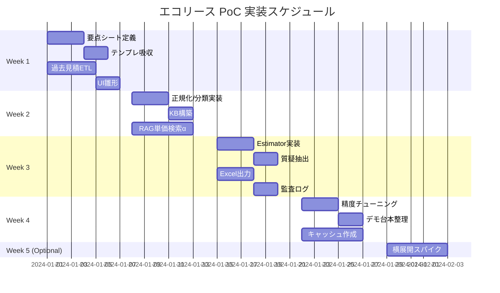

# エコリース社 入札見積自動化システム PoC仕様書

## 1. エグゼクティブサマリー

### 1.1 プロジェクト概要

入札資料（PDF/Excel/Docx）を投入すると、約5分以内に見積草案・質疑ドラフト・法令根拠リストを自動生成するシステムのPoC開発。

### 1.2 処理フロー（概要）

```
入札資料 → FMT正規化 → 必須項目抽出 → 単価RAG → 法令KB参照 → 見積草案生成
```

### 1.3 デモ出力物

| 出力物 | 形式 | 説明 |
|--------|------|------|
| 見積草案 | Excel | 御社テンプレ互換、根拠列付き |
| 質疑書ドラフト | PDF/Docx | 不確定要素を自動抽出 |
| 法令根拠リスト | JSON/Excel | 条番号・年版・出典URL |

---

## 2. デモのゴール・スコープ

### 2.1 ゴール

- **処理時間**: 入札PDF一式を投入 → 約5分以内に出力完了
- **見積精度**: 70%の完成度を目標（残り30%は人手レビュー）
- **トレーサビリティ**: 全ての数値に根拠（事例/条文/計算式）を紐付け

### 2.2 対象スコープ

| フェーズ | 対象施設 | 工種 |
|----------|----------|------|
| Phase 1（デモ） | 学校（改修/建替え） | 電気・空調・給排水・防災 |
| Phase 2（評価後） | 自衛隊施設 | 横展開 |
| Phase 3（評価後） | 現場事務所 | 横展開 |

---

## 3. システムアーキテクチャ

### 3.1 ハイレベルアーキテクチャ

```
┌─────────────────────────────────────────────────────────────────────┐
│                          Upload UI (Streamlit)                       │
└─────────────────────────────────────────────────────────────────────┘
                                    │
                                    ▼
┌─────────────────────────────────────────────────────────────────────┐
│                         Doc Ingest Layer                             │
│  ┌─────────────┐  ┌─────────────┐  ┌─────────────┐                  │
│  │  PDF Parser │  │ OCR Engine  │  │Layout Parser│                  │
│  │  (PyMuPDF)  │  │ (Tesseract) │  │(Unstructured)│                  │
│  └─────────────┘  └─────────────┘  └─────────────┘                  │
└─────────────────────────────────────────────────────────────────────┘
                                    │
                                    ▼
┌─────────────────────────────────────────────────────────────────────┐
│                       FMT Normalizer                                 │
│  ┌─────────────────────┐  ┌─────────────────────┐                   │
│  │   要点シート(JSON)   │  │  添付メタ/図面メタ   │                   │
│  └─────────────────────┘  └─────────────────────┘                   │
└─────────────────────────────────────────────────────────────────────┘
                                    │
                                    ▼
┌─────────────────────────────────────────────────────────────────────┐
│                     分類器 (用途/工種)                               │
└─────────────────────────────────────────────────────────────────────┘
                    │                           │
                    ▼                           ▼
    ┌───────────────────────┐     ┌───────────────────────┐
    │   過去見積KB (FAISS)   │     │    法令KB (FAISS)     │
    │      RAG Search       │     │      RAG Search       │
    └───────────────────────┘     └───────────────────────┘
                    │                           │
                    └───────────┬───────────────┘
                                ▼
┌─────────────────────────────────────────────────────────────────────┐
│                         Estimator                                    │
│  ┌─────────────┐  ┌─────────────┐  ┌─────────────┐                  │
│  │  数量推定   │  │  型番選定   │  │  質疑抽出   │                  │
│  └─────────────┘  └─────────────┘  └─────────────┘                  │
└─────────────────────────────────────────────────────────────────────┘
                                    │
                                    ▼
┌─────────────────────────────────────────────────────────────────────┐
│                    Excel/PDF Export + 監査ログ                       │
└─────────────────────────────────────────────────────────────────────┘
```

### 3.2 セキュリティ分離設計

| レイヤー | 処理内容 | ネットワーク |
|----------|----------|--------------|
| 社内データ処理系 | 入札/見積/図面の解析 | 社内ネットワーク |
| 外部参照系 | 法令/公知規格クローラ | DMZ経由 |

> **デモ時の注意**: 外部参照はキャッシュ優先（当日ネット障害リスク回避）

---

## 4. データ契約（スキーマ定義）

### 4.1 入力ファイル仕様

| ファイル種別 | 形式 | 用途 |
|--------------|------|------|
| 入札資料 | PDF | 案件情報・仕様抽出 |
| 質疑・回答 | PDF/Docx | 補足情報 |
| 過去見積 | Excel | 単価KB構築 |
| 図面 | PDF | 数量算出参考 |

### 4.2 FMT（社内統一フォーマット）スキーマ v1

```json
{
  "tender_header": {
    "project_name": "string",
    "client": "string",
    "category": "school | military | site_office | other",
    "location_pref": "string",
    "floor_area_m2": "number",
    "num_rooms": "integer",
    "building_age": "integer | null",
    "deadline": "date | null"
  },
  "requirements": [
    {
      "discipline": "electric | hvac | plumbing | fire",
      "topic": "照度 | コンセント | 換気量 | 空調能力 | 配管径 | 非常放送 | 感知器等",
      "target_value": "string | number",
      "standard_ref": "{law_code}:{article}:{year}",
      "source_page": "int",
      "confidence": "0-1"
    }
  ],
  "attachments": [
    {
      "type": "drawing | price_sheet | qa",
      "path": "string",
      "page": "int"
    }
  ],
  "metadata": {
    "doc_hash": "sha256",
    "ingested_at": "datetime"
  }
}
```

### 4.3 過去見積KB スキーマ

```json
{
  "item_id": "string",
  "description": "string",
  "discipline": "electric | hvac | plumbing | fire",
  "unit": "台 | 本 | m | m2 | 式 | 回",
  "unit_price": 12345,
  "vendor": "string | null",
  "valid_from": "date",
  "valid_to": "date | null",
  "source_project": "string",
  "context_tags": ["学校", "普通教室", "改修"],
  "features": {
    "room_area_m2": 50,
    "ceiling_height_m": 2.7
  }
}
```

### 4.4 法令KB スキーマ

```json
{
  "law_code": "JEAC8001 | 建築基準法 | 電気設備技術基準 | SHASE | JIS...",
  "title": "string",
  "article": "string",
  "year": 2024,
  "clause_text": "string",
  "norm_value": {
    "topic": "照度",
    "value": "300lx",
    "condition": "普通教室"
  },
  "citation": {
    "url": "string",
    "publisher": "string"
  }
}
```

---

## 5. 関係法令一覧

### 5.1 共通関係法令（電気・管工事 共通）

| No. | 法令・規格名 | 重要度 | 備考 |
|-----|-------------|--------|------|
| 1 | **建築基準法・建築基準法施行規則** | ★★★ | 必須 |
| 2 | **建築基準法施行令** | ★★★ | 必須 |
| 3 | 労働安全衛生法 | ★★ | |
| 4 | エネルギーの使用の合理化等に関する法律（省エネ法） | ★★ | |
| 5 | **内線規程（JEAC 8001）** | ★★★ | 電気工事の基本 |
| 6 | **学校施設設備基準** | ★★★ | 学校案件必須 |
| 7 | **学校環境衛生管理マニュアル・学校保健安全法／学校環境衛生基準** | ★★★ | 学校案件必須 |
| 8 | 寄宿舎規定 | ★ | 該当時のみ |
| 9 | **消防法・消防法施行規則・消防法施行令** | ★★★ | 防災設備必須 |
| 10 | バリアフリー法 | ★★ | |
| 11 | 都道府県条例、市町村条例、東京都工事標準仕様書 | ★★ | 地域依存 |
| 12 | 厚生労働省 健康増進法（受動喫煙防止法） | ★ | |
| 13 | ビル管理法 | ★ | 大型物件のみ |
| 14 | 医療法・医療法施行規則 | ★★ | 病院案件 |
| 15 | PL法・食品衛生法 | ★ | 厨房設備 |
| 16 | こども家庭庁 児童福祉施設最低基準 | ★★ | 児童施設 |
| 17 | **公共工事標準仕様書** | ★★★ | 公共案件必須 |

### 5.2 電気工事関連 法令・基準

| No. | 法令・規格名 | 重要度 | 備考 |
|-----|-------------|--------|------|
| 1 | **電気事業法** | ★★★ | 必須 |
| 2 | **電気設備技術基準（省令）** | ★★★ | 必須 |
| 3 | **電気設備技術基準の解釈（経済産業省告示）** | ★★★ | 必須 |
| 4 | 電気用品安全法（PSE法） | ★★ | |
| 5 | **日本電気協会規程（JEAC・JEITA）** | ★★★ | |
| 6 | JIS規格 | ★★ | |
| 7 | **公共建築工事標準仕様書（電気設備工事編）** | ★★★ | 公共案件必須 |

### 5.3 管工事関連 法令・基準

| No. | 法令・規格名 | 重要度 | 備考 |
|-----|-------------|--------|------|
| 1 | **建築設備設計基準（国交省・官庁営繕部）** | ★★★ | 必須 |
| 2 | **空気調和・衛生工学会（SHASE）規格** | ★★★ | 空調必須 |
| 3 | 水道法施行規則／給水装置基準 | ★★ | 給水設備 |
| 4 | 下水道法・下水道法施行令・下水道法施行規則 | ★★ | 排水設備 |
| 5 | ガス事業法／LPガス法 | ★★ | ガス設備 |
| 6 | **公共建築設備工事標準図（機械設備編）／標準仕様書** | ★★★ | 公共案件必須 |
| 7 | 都市ガス事業法・液化石油ガス法 | ★ | |
| 8 | 水質汚濁防止法 | ★ | |
| 9 | 浄化槽法 | ★ | 浄化槽設置時 |

### 5.4 参照ドキュメント（付録）

| ドキュメント名 | 版 | 用途 |
|---------------|-----|------|
| 建築設備設計基準 | 令和6年度版 | 設計基準値参照 |
| 公共建築工事標準仕様書（電気設備工事編） | 最新版 | 電気工事仕様 |
| 公共建築工事標準仕様書（機械設備工事編） | 最新版 | 機械設備仕様 |

---

## 6. パイプライン設計

### 6.1 Doc Ingest & 正規化

```python
# pipelines/ingest.py の概要

class DocIngestor:
    """
    入札資料の取り込みと正規化を担当
    """
    
    def extract(self, file_path: str) -> RawDocument:
        """
        PyMuPDF/pdfplumber でテキスト・表・画像を切り出し
        表はpandas DataFrameに変換
        """
        pass
    
    def apply_ocr(self, doc: RawDocument) -> RawDocument:
        """
        埋め込み文字が粗い場合のみ Tesseract/PaddleOCR を適用
        条件: 文字認識信頼度 < 0.8
        """
        pass
    
    def analyze_layout(self, doc: RawDocument) -> StructuredDocument:
        """
        layoutparser/Unstructured で章・表・図・凡例を区分
        """
        pass
    
    def map_to_fmt(self, doc: StructuredDocument) -> FMTDocument:
        """
        mapping_rules.yaml に基づきFMTにマッピング
        フィールドごとにconfidenceを採点（閾値 < 0.8 はレビュー待ち）
        """
        pass
```

### 6.2 分類器（用途/工種）

```python
# pipelines/classify.py の概要

class ProjectClassifier:
    """
    案件の用途・工種を分類
    """
    
    CATEGORIES = ["school", "military", "site_office", "other"]
    DISCIPLINES = ["electric", "hvac", "plumbing", "fire"]
    
    def classify(self, fmt_doc: FMTDocument) -> ClassificationResult:
        """
        BOW + 埋め込みで粗分類
        誤りは1クリック補正UIで対応
        """
        pass
```

### 6.3 KB構築

```python
# pipelines/build_kb.py の概要

class KBBuilder:
    """
    Knowledge Base の構築・更新
    """
    
    def build_estimate_kb(self, excel_files: List[str]) -> EstimateKB:
        """
        過去見積ExcelをETL
        - description, discipline, unit, unit_price, context_tags を索引化
        - 同義語辞書で名寄せ（例: "非常警報設備" ≒ "非常放送"）
        - 単位換算対応（m ↔ 本/式）
        """
        pass
    
    def build_law_kb(self, law_list: List[str]) -> LawKB:
        """
        採用法令リストを初期ロード
        - 条番号と年版を主キー化
        - 外部取得は夜間バッチでキャッシュ更新
        """
        pass
```

### 6.4 RAG検索戦略

```python
# pipelines/rag_price.py / rag_law.py の概要

class PriceRAG:
    """
    単価候補検索
    """
    
    def search(self, query: RAGQuery) -> List[PriceCandidate]:
        """
        query = discipline + item_keyword + context(room_type, area)
        FAISS/Qdrant で k近傍取得
        """
        pass
    
    def aggregate(self, candidates: List[PriceCandidate]) -> RecommendedPrice:
        """
        時系列重み + コンテキスト一致度で最尤単価を選択
        メディアン推奨
        """
        pass

class LawRAG:
    """
    法令照合
    """
    
    def search(self, topic: str, context: Dict) -> List[LawReference]:
        """
        topicに対応する規範値をLawKBから引当
        改修/新築/用途で分岐
        """
        pass
```

### 6.5 Estimator（数量・型番・見積生成）

```python
# pipelines/estimate.py の概要

class Estimator:
    """
    数量推定・型番選定・見積生成
    """
    
    # デモ用 数量推定ルール
    QUANTITY_RULES = {
        "照明台数": "ceil(floor_area_m2 / 8)",      # 教室想定
        "コンセント数": "ceil(6 + floor_area_m2 / 10)",
        "換気量": "room_volume * ACH",              # ACHは用途別規範値
    }
    
    def estimate_quantity(self, fmt_doc: FMTDocument) -> List[QuantityItem]:
        """
        ルールベースで数量を推定
        """
        pass
    
    def select_model(self, item: str, kb: EstimateKB) -> List[ModelCandidate]:
        """
        過去採用品から上位3件を候補
        在庫/調達性タグがあれば加点
        """
        pass
    
    def generate_estimate(self, items: List[EstimateItem]) -> EstimateSheet:
        """
        行構成: 工種 > 項目 > 数量 > 単位 > 単価 > 金額 > 根拠
        """
        pass
    
    def export_excel(self, sheet: EstimateSheet, template: str) -> bytes:
        """
        御社テンプレに合わせてExcel出力
        export_mapping.json で列名マッピング
        """
        pass
```

### 6.6 質疑抽出器

```python
# pipelines/qa_extractor.py の概要

class QAExtractor:
    """
    不確定要素の自動抽出・質疑ドラフト生成
    """
    
    TEMPLATES = {
        "換気仕様": "換気設備について、必要換気量の算定根拠をご教示ください。",
        "非常放送": "非常放送設備の系統分割について、具体的な仕様をご確認ください。",
        # ...
    }
    
    def extract(self, fmt_doc: FMTDocument) -> List[UncertainItem]:
        """
        confidence < 0.8 または必須項目欠損を抽出
        """
        pass
    
    def generate_draft(self, items: List[UncertainItem]) -> QADocument:
        """
        定型文テンプレにはめ込み
        """
        pass
```

### 6.7 監査ログ

```python
# pipelines/audit.py の概要

class AuditLogger:
    """
    再現性のための監査ログ
    """
    
    def log(self, session_id: str, audit_data: AuditData) -> None:
        """
        保存項目:
        - 入力hash
        - モデル/辞書バージョン
        - RAGヒットIDs
        - 法令条番号
        - 確率/スコア
        """
        pass
```

---

## 7. 技術スタック

### 7.1 推奨構成

| カテゴリ | 技術 | 選定理由 |
|----------|------|----------|
| **Backend** | Python 3.11 + FastAPI | 高速な非同期処理、型ヒント対応 |
| **Parsing** | PyMuPDF, pdfplumber, unstructured, layoutparser | PDF解析の実績 |
| **OCR** | Tesseract (+jpn) | OSS、日本語対応 |
| **Embeddings** | bge-m3 | 多言語対応、高精度 |
| **Vector DB** | FAISS | ローカル実行、高速検索 |
| **LLM** | Azure OpenAI (GPT-4o) | 社内許諾済みを想定 |
| **UI** | Streamlit | 迅速なデモ構築 |
| **Export** | openpyxl | Excelテンプレート書き込み |
| **Infra** | Docker Compose | 環境再現性 |

### 7.2 代替オプション

| カテゴリ | 代替技術 | 採用条件 |
|----------|----------|----------|
| OCR | PaddleOCR | 精度重視の場合 |
| Embeddings | text-embedding-3-large | クラウド利用可の場合 |
| Vector DB | Qdrant (Docker) | スケーラビリティ重視 |
| LLM | ローカルLLM | セキュリティ要件 |
| UI | Next.js | 本番UI構築時 |

---

## 8. リポジトリ構成

```
ecolease-poc/
├── api/                          # FastAPI バックエンド
│   ├── main.py
│   ├── routers/
│   │   ├── ingest.py
│   │   ├── estimate.py
│   │   └── export.py
│   └── dependencies.py
│
├── ui/                           # Streamlit フロントエンド
│   ├── app.py
│   ├── pages/
│   │   ├── 1_upload.py
│   │   ├── 2_review.py
│   │   ├── 3_estimate.py
│   │   └── 4_audit.py
│   └── components/
│
├── pipelines/                    # コアロジック
│   ├── __init__.py
│   ├── ingest.py                # ドキュメント取り込み
│   ├── normalize.py             # FMT正規化
│   ├── classify.py              # 用途/工種分類
│   ├── build_kb.py              # KB構築
│   ├── rag_price.py             # 単価RAG
│   ├── rag_law.py               # 法令RAG
│   ├── estimate.py              # 見積生成
│   ├── qa_extractor.py          # 質疑抽出
│   └── audit.py                 # 監査ログ
│
├── configs/                      # 設定ファイル
│   ├── mapping_rules.yaml       # FMTマッピングルール
│   ├── export_mapping.json      # Excel出力マッピング
│   ├── synonyms.yaml            # 同義語辞書
│   └── quantity_rules.yaml      # 数量推定ルール
│
├── kb/                           # Knowledge Base
│   ├── estimates.parquet        # 過去見積データ
│   ├── lawkb.parquet            # 法令データ
│   └── embeddings/              # ベクトルインデックス
│
├── templates/                    # 出力テンプレート
│   ├── estimate_template.xlsx
│   └── qa_template.docx
│
├── tests/                        # テスト
│   ├── demo_docs/               # テスト用ドキュメント
│   ├── test_ingest.py
│   ├── test_rag.py
│   └── e2e_demo.py
│
├── docker-compose.yml
├── Dockerfile
├── requirements.txt
├── pyproject.toml
└── README.md
```

---

## 9. 精度指標（デモKPI）

| 指標 | 目標値 | 測定方法 |
|------|--------|----------|
| 必須項目抽出再現率 | ≥ 90% | 正解ラベルとの比較 |
| 単価RAG中央値誤差（MAPE） | ≤ 15% | 実見積との比較 |
| 合計見積差 | ±15% 以内 | 学校サンプルで検証 |
| 処理時間 | ≤ 5分 | 10MB/50ページ想定 |

---

## 10. 実装スケジュール（4〜5週間）



### 週次マイルストーン

| 週 | 成果物 |
|----|--------|
| W1 | 要点シート定義完了、過去見積ETL完了、UI雛形動作 |
| W2 | 正規化パイプライン動作、KB構築完了、RAG検索α版 |
| W3 | Estimator動作、Excel出力完了、監査ログ実装 |
| W4 | 精度目標達成、デモ台本完成、当日用キャッシュ準備 |
| W5 | （オプション）自衛隊/現場事務所の横展開検証 |

---

## 11. リスクと回避策

| リスク | 影響度 | 発生確率 | 回避策 |
|--------|--------|----------|--------|
| 入札様式のバラつき | 高 | 高 | FMT項目を必要最小に絞る、低信頼は質疑へ回す |
| 単価の時期ズレ | 中 | 高 | 直近案件に重み付け、古い案件は減衰係数適用 |
| 法令更新 | 中 | 中 | 年版キーで固定、外部参照はキャッシュ/承認フロー |
| 図面→数量の自動化 | 高 | 高 | 現段階は概算提示に留め、数量は簡易ルール |
| デモ当日のネット障害 | 高 | 低 | 外部参照を事前キャッシュ |

---

## 12. デモシナリオ（台本）

### Step 1: PDF投入
```
1. 入札PDFをドラッグ&ドロップ
2. 自動抽出が走行（プログレスバー表示）
3. 右パネルに要点シート（JSONプレビュー）表示
```

### Step 2: 不足項目確認
```
1. 不足項目が赤色でハイライト表示
2. 1クリックで補足入力 or スキップ（質疑に回る）
3. 「再計算」ボタンで更新
```

### Step 3: RAG結果確認
```
1. 単価候補と根拠のプレビュー表示
   - 事例サマリ
   - 法令条番号
2. 候補の選択/調整が可能
```

### Step 4: 見積生成
```
1. 「見積作成」ボタンクリック
2. 以下をダウンロード可能に:
   - 見積草案（Excel）
   - 質疑ドラフト（PDF）
   - 法令根拠リスト（JSON）
```

### Step 5: 監査ビュー
```
1. 各数値の根拠をトレース可能
   - RAGヒット元
   - 法令条番号
   - 計算式
2. 再現性の確保
```

---

## 13. 必要資料

### 先方（エコリース社）からの提供物

| 資料 | 用途 | 必要数 |
|------|------|--------|
| 代表案件（入札/QA/見積/図面） | KB構築・精度検証 | 10〜20件 |
| 見積Excelテンプレート | 出力フォーマット | 1式 |
| 採用法令リスト（年版/条番号） | 法令KB構築 | 1式 |

### AICE側の準備物

| 資料 | 用途 |
|------|------|
| セキュリティ分離アーキ図 | 設計レビュー |
| FMT定義 v1 / mapping_rules.yaml | 実装仕様 |
| 既定単価辞書（不足領域の初期値） | KB補完 |

---

## 14. 体制

| 役割 | 担当 | 所属 |
|------|------|------|
| PM/要件 | 星田 | AICE |
| Tech Lead | 山岡 | AICE |
| Parsing/RAG/Estimator実装 | TBD | AICE（各1名） |
| QA（積算経験者レビュー） | TBD | 先方1名 + AICE1名 |

---

## 15. 補足：数量推定ルール（デモ用）

### 15.1 照明設備

| 項目 | 計算式 | 備考 |
|------|--------|------|
| 照明台数 | `ceil(floor_area_m2 / 8)` | 普通教室想定（300lx基準） |
| 非常照明 | `ceil(floor_area_m2 / 100)` | 避難経路用 |

### 15.2 電気設備

| 項目 | 計算式 | 備考 |
|------|--------|------|
| コンセント数 | `ceil(6 + floor_area_m2 / 10)` | 教室基準 |
| 分電盤 | `ceil(num_rooms / 10)` | 10教室に1台 |

### 15.3 空調設備

| 項目 | 計算式 | 備考 |
|------|--------|------|
| 換気量 | `room_volume × ACH` | ACHは用途別規範値参照 |
| 空調能力 | `floor_area_m2 × 冷房負荷係数` | 130〜180W/m²（用途別） |

---

## 変更履歴

| 日付 | バージョン | 変更内容 | 担当 |
|------|-----------|----------|------|
| 2024-11-04 | v1.0 | 初版作成 | 星田 |
| 2024-11-21 | v1.1 | 法令一覧追加、技術選定詳細化 | - |

---

*本ドキュメントはPoC開発用の仕様書です。実運用に向けては追加のセキュリティレビュー・性能検証が必要です。*